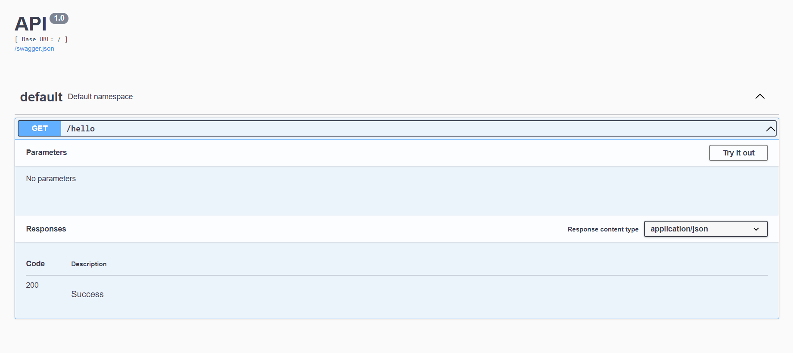

# ML_Ops
=========================================

== Please check the 'apis/hello.py' file 

- Imported flask and flask_restx 
- Created hello.py - hosting basic flask app
- Use the following to run the app

'''
$env:FLASK_APP = "hello"
'''

