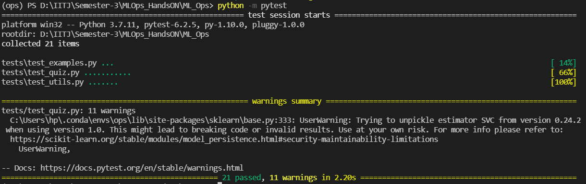

# ML_Ops
=========================================

== Please check the 'tests/test_quiz.py' and 'quiz_test_case.py' file 
== Completed Both the questions (test cases for each class + bonus component)

