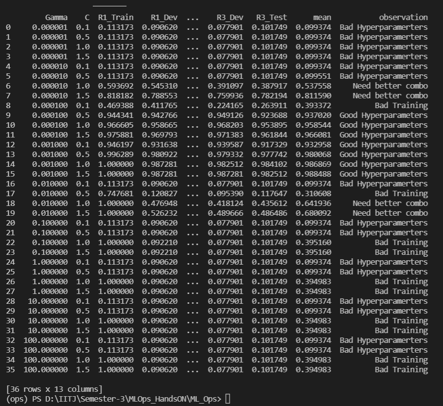
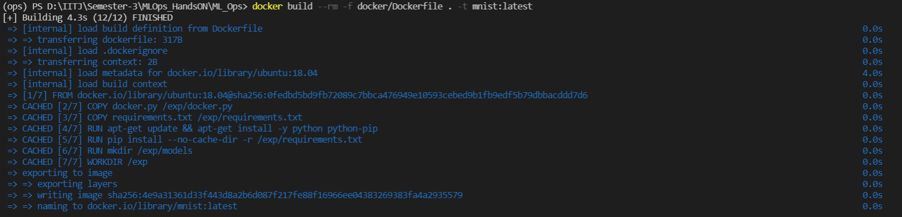
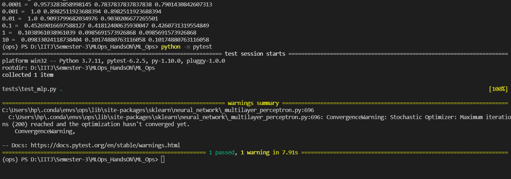

# ML_Ops
<<<<<<< HEAD
=========================================
# Final Examination
=========================================


# Question 1 
=========================================
== Please check the 'final_exam.py' file

-- As per the question, there are 3 runs for different combination of 2 hyperparameters - gamma and C in SVM setting. 
-- For all 3 runs, I compute the mean accuracy. 
-- For all over results with observations, I print the table in console and have also preapared a csv file with all the values.
-- To view the CSV file, please check 'Final_Table.csv'
-- For observation column, a generalized view is taken on the mean accuracy as it accounts for overfitting paramter wherein training accuracy is almost 100% but testing and validation accuracy decreases. Such combinations are marked as Bas Hyperparameters as can be viewed in the figure below. 




# Question 2 (Docker)
=========================================
== Please check the 'docker.py' file and 'docker/Dockerfile' file

I have used the following command to build the docker image -
```
docker build --rm -f docker/Dockerfile . -t mnist:latest
```
To create the container I have used -
```
docker run -it mnist:latest -v D:/IITJ/Semester-3/MLOps_HandsON/ML_Ops/Model:/exp
```


# Question 3 (Bonus)
=========================================
== For MLPClassifier, please check 'bonus.py' and 'tests/test_mlp.py'

I have attached the screenshot for both the files below and have not completed the Github actions part-



