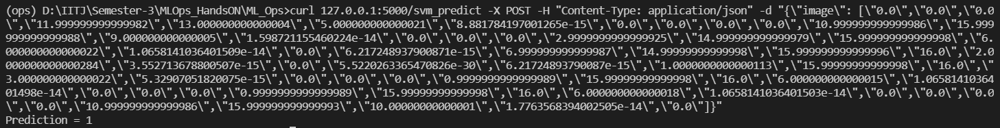
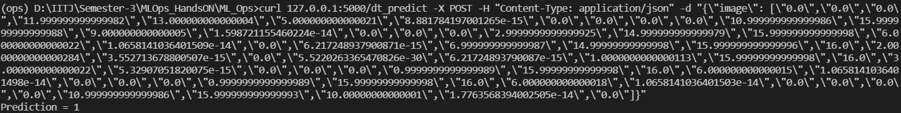
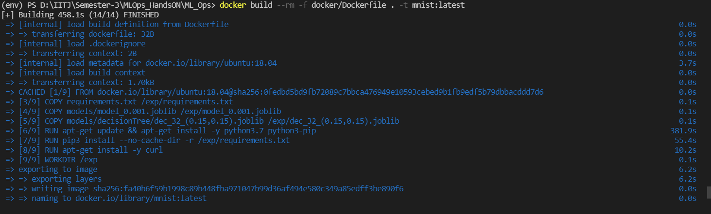
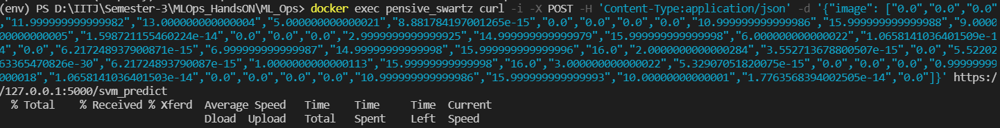
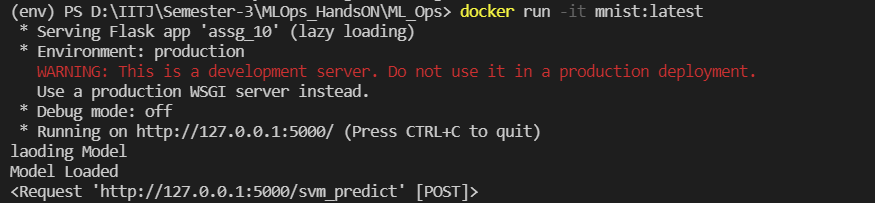

# ML_Ops
=========================================
# Assignment 10
=========================================

Check files ->
1. apis/assg_10.py
2. docker/Dockerfile
3. docker_example.sh

## Different Post command for SVM and Dec Tree 
===============================================
SVM Tree Command and Output -

```
curl 127.0.0.1:5000/svm_predict -X POST -H "Content-Type: application/json" -d "{\"image\": [\"0.0\",\"0.0\",\"0.0\",\"11.999999999999982\",\"13.000000000000004\",\"5.000000000000021\",\"8.881784197001265e-15\",\"0.0\",\"0.0\",\"0.0\",\"0.0\",\"10.999999999999986\",\"15.999999999999988\",\"9.000000000000005\",\"1.598721155460224e-14\",\"0.0\",\"0.0\",\"0.0\",\"2.9999999999999925\",\"14.999999999999979\",\"15.999999999999998\",\"6.000000000000022\",\"1.0658141036401509e-14\",\"0.0\",\"6.217248937900871e-15\",\"6.999999999999987\",\"14.99999999999998\",\"15.999999999999996\",\"16.0\",\"2.0000000000000284\",\"3.552713678800507e-15\",\"0.0\",\"5.5220263365470826e-30\",\"6.21724893790087e-15\",\"1.0000000000000113\",\"15.99999999999998\",\"16.0\",\"3.000000000000022\",\"5.32907051820075e-15\",\"0.0\",\"0.0\",\"0.0\",\"0.9999999999999989\",\"15.99999999999998\",\"16.0\",\"6.000000000000015\",\"1.0658141036401498e-14\",\"0.0\",\"0.0\",\"0.0\",\"0.9999999999999989\",\"15.99999999999998\",\"16.0\",\"6.000000000000018\",\"1.0658141036401503e-14\",\"0.0\",\"0.0\",\"0.0\",\"0.0\",\"10.999999999999986\",\"15.999999999999993\",\"10.00000000000001\",\"1.7763568394002505e-14\",\"0.0\"]}"
```



Decision Tree Command and Output - 

```
curl 127.0.0.1:5000/dt_predict -X POST -H "Content-Type: application/json" -d "{\"image\": [\"0.0\",\"0.0\",\"0.0\",\"11.999999999999982\",\"13.000000000000004\",\"5.000000000000021\",\"8.881784197001265e-15\",\"0.0\",\"0.0\",\"0.0\",\"0.0\",\"10.999999999999986\",\"15.999999999999988\",\"9.000000000000005\",\"1.598721155460224e-14\",\"0.0\",\"0.0\",\"0.0\",\"2.9999999999999925\",\"14.999999999999979\",\"15.999999999999998\",\"6.000000000000022\",\"1.0658141036401509e-14\",\"0.0\",\"6.217248937900871e-15\",\"6.999999999999987\",\"14.99999999999998\",\"15.999999999999996\",\"16.0\",\"2.0000000000000284\",\"3.552713678800507e-15\",\"0.0\",\"5.5220263365470826e-30\",\"6.21724893790087e-15\",\"1.0000000000000113\",\"15.99999999999998\",\"16.0\",\"3.000000000000022\",\"5.32907051820075e-15\",\"0.0\",\"0.0\",\"0.0\",\"0.9999999999999989\",\"15.99999999999998\",\"16.0\",\"6.000000000000015\",\"1.0658141036401498e-14\",\"0.0\",\"0.0\",\"0.0\",\"0.9999999999999989\",\"15.99999999999998\",\"16.0\",\"6.000000000000018\",\"1.0658141036401503e-14\",\"0.0\",\"0.0\",\"0.0\",\"0.0\",\"10.999999999999986\",\"15.999999999999993\",\"10.00000000000001\",\"1.7763568394002505e-14\",\"0.0\"]}"
```




## Dockerizing 
=============================
Building docker image -

```
docker build --rm -f docker/Dockerfile . -t mnist:latest
```


Creating the container -

```
docker run -it mnist:latest
```


Running docker container -


Using docker exec command for prediction -

```
docker exec pensive_swartz curl 127.0.0.1:5000/dt_predict -X POST -H "Content-Type: application/json" -d "{\"image\": [\"0.0\",\"0.0\",\"0.0\",\"11.999999999999982\",\"13.000000000000004\",\"5.000000000000021\",\"8.881784197001265e-15\",\"0.0\",\"0.0\",\"0.0\",\"0.0\",\"10.999999999999986\",\"15.999999999999988\",\"9.000000000000005\",\"1.598721155460224e-14\",\"0.0\",\"0.0\",\"0.0\",\"2.9999999999999925\",\"14.999999999999979\",\"15.999999999999998\",\"6.000000000000022\",\"1.0658141036401509e-14\",\"0.0\",\"6.217248937900871e-15\",\"6.999999999999987\",\"14.99999999999998\",\"15.999999999999996\",\"16.0\",\"2.0000000000000284\",\"3.552713678800507e-15\",\"0.0\",\"5.5220263365470826e-30\",\"6.21724893790087e-15\",\"1.0000000000000113\",\"15.99999999999998\",\"16.0\",\"3.000000000000022\",\"5.32907051820075e-15\",\"0.0\",\"0.0\",\"0.0\",\"0.9999999999999989\",\"15.99999999999998\",\"16.0\",\"6.000000000000015\",\"1.0658141036401498e-14\",\"0.0\",\"0.0\",\"0.0\",\"0.9999999999999989\",\"15.99999999999998\",\"16.0\",\"6.000000000000018\",\"1.0658141036401503e-14\",\"0.0\",\"0.0\",\"0.0\",\"0.0\",\"10.999999999999986\",\"15.999999999999993\",\"10.00000000000001\",\"1.7763568394002505e-14\",\"0.0\"]}"
```

```
docker exec pensive_swartz curl -i -X POST -H 'Content-Type: application/json' -d '{"image": ["0.0","0.0","0.0","11.999999999999982","13.000000000000004","5.000000000000021","8.881784197001265e-15","0.0","0.0","0.0","0.0","10.999999999999986","15.999999999999988","9.000000000000005","1.598721155460224e-14","0.0","0.0","0.0","2.9999999999999925","14.999999999999979","15.999999999999998","6.000000000000022","1.0658141036401509e-14","0.0","6.217248937900871e-15","6.999999999999987","14.99999999999998","15.999999999999996","16.0","2.0000000000000284","3.552713678800507e-15","0.0","5.5220263365470826e-30","6.21724893790087e-15","1.0000000000000113","15.99999999999998","16.0","3.000000000000022","5.32907051820075e-15","0.0","0.0","0.0","0.9999999999999989","15.99999999999998","16.0","6.000000000000015","1.0658141036401498e-14","0.0","0.0","0.0","0.9999999999999989","15.99999999999998","16.0","6.000000000000018","1.0658141036401503e-14","0.0","0.0","0.0","0.0","10.999999999999986","15.999999999999993","10.00000000000001","1.7763568394002505e-14","0.0"]}' 127.0.0.1:5000/svm_predict 
```
