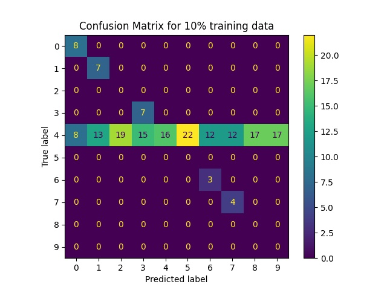
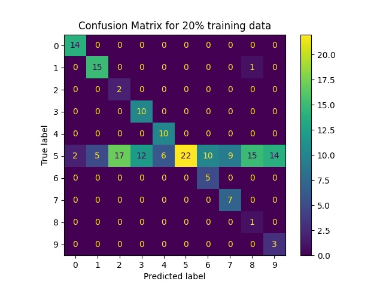
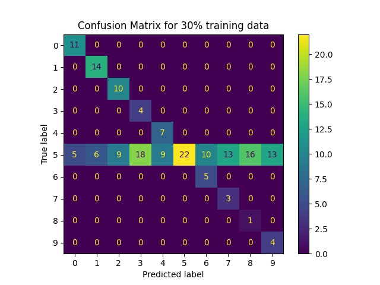
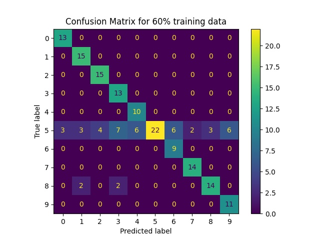
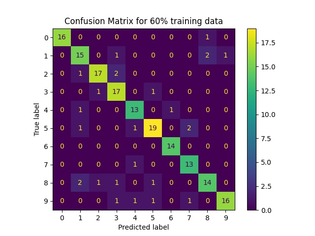
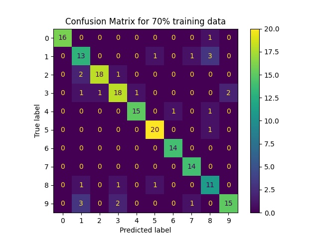
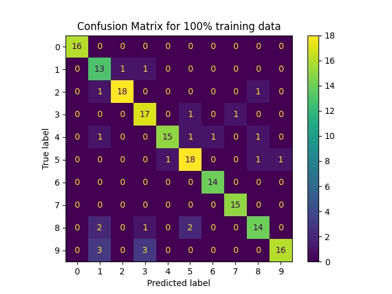

# ML_Ops
=========================================
# Assignment 11
=========================================

== Please check the 'assg_11.py' and 'assg_11_plot.py' file 

## SVM Statistics - Confusion Matrix 

  
   
   

  
   
   

  

  
   
   

  

## DT Statistics - Confusion Matrix 

  
   
   

  
   
   

  

  
   
   

  

